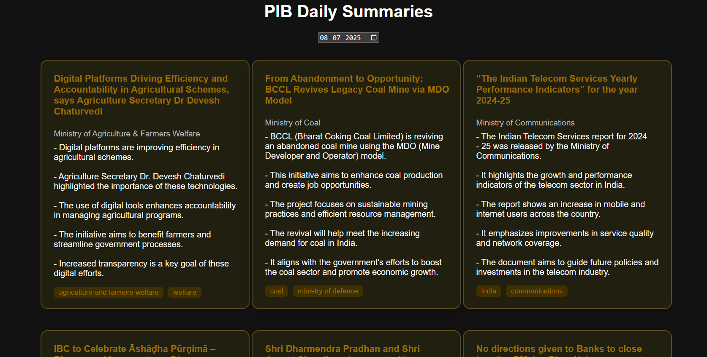

# Press Information Bureau (PIB) Daily Summary Web App

<div align="center">
  
</div>

---

## 🚀 Project Essence

This web app helps students preparing for competitive exams (like UPSC, State PSCs, SSC, etc.) save valuable time in current affairs note-making. It automatically fetches daily press releases from the Press Information Bureau (PIB), summarizes them using advanced AI models (LLMs), and presents the key points in a concise, student-friendly format. Each summary is tagged by topic and ministry, with abbreviations expanded for clarity, making revision and topic tracking effortless.

---

## 🛠️ User Manual

1. **Install requirements:**
   ```bash
   pip install -r requirements.txt
   ```
2. **Update your OpenAI API key:**
   - Open the `.env` file in the project root.
   - Add your OpenAI API key as:
     ```env
     OPENAI_API_KEY=sk-...
     ```
3. **Run the backend server:**
   - In your terminal, from the project root, run:
     ```bash
     uvicorn backend.api_server:app --host 0.0.0.0 --port 8000
     ```
   - The server will be available at `http://localhost:8000`.
4. **Open the frontend:**
   - Open `frontend/index.html` in your local browser.
   - For best results, serve the frontend with a simple HTTP server (e.g., `python -m http.server` in the `frontend` directory) and visit `http://localhost:8000` or `http://localhost:8080`.

---

## 💡 Features

- **Automated Summarization:** Uses AI/LLMs (OpenAI GPT, DeepSeek) to generate short, clear, exam-focused summaries from PIB articles.
- **Tag Generation:** AI extracts and expands relevant tags and abbreviations for easy organization and search.
- **Flexible LLM Integration:** Supports both OpenAI and OpenRouter/DeepSeek APIs.
- **Modern Frontend:** Responsive sticky-note style cards built with HTML, CSS, and JavaScript.
- **Seamless Data Flow:** Backend automates scraping, summarization, tagging, and storage in local JSON files, which the frontend fetches and displays by date.
- **User Experience:** Date selection, tag display, and error handling for practical, user-friendly browsing.
- **Open Source & Local:** All data is stored locally in JSON files—no login or cloud required.

---

## 🎯 How It Helps Students

- **Saves Time:** No more manual reading and summarizing of lengthy PIB articles—get ready-to-use, bullet-point notes every day.
- **Student-Friendly Summaries:** AI-generated summaries are short, clear, and focused on what matters for exams.
- **Easy Tagging & Filtering:** Summaries are tagged by ministry and topic, helping you quickly find and revise relevant content.
- **Modern, Responsive UI:** Sticky-note style cards make browsing summaries enjoyable on any device.

---

## 🤝 Call for Community Contributions

This project is open source and welcomes contributions! Whether you are a developer, designer, educator, or exam aspirant, your ideas and improvements can help make this tool even more useful. Possible areas for contribution:

- Improving the AI summarization or tagging logic
- Enhancing the UI/UX for better readability and accessibility
- Adding new features (search, export, notifications, etc.)
- Expanding to other sources or exam types

Feel free to fork, suggest features, or submit pull requests. Together, we can build a smarter, time-saving resource for all exam aspirants!

---
